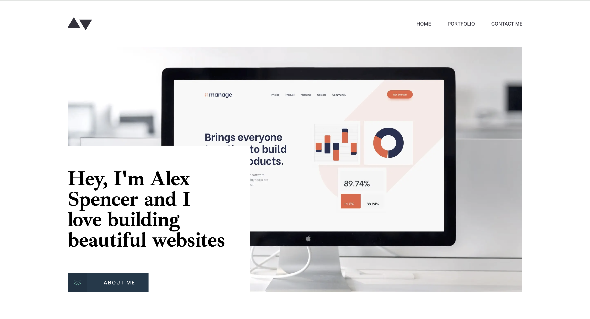

# Frontend Mentor - Minimalist portfolio website solution

This is a solution to the [Minimalist portfolio website challenge on Frontend Mentor](https://www.frontendmentor.io/challenges/minimalist-portfolio-website-LMy-ZRyiE). Frontend Mentor challenges help you improve your coding skills by building realistic projects.

### The challenge

Users should be able to:

- View the optimal layout for each page depending on their device's screen size
- See hover states for all interactive elements throughout the site
- Click the "About Me" call-to-action on the homepage and have the screen scroll down to the next section
- Receive an error message when the contact form is submitted if:
  - The `Name`, `Email Address` or `Message` fields are empty should show "This field is required"
  - The `Email Address` is not formatted correctly should show "Please use a valid email address"

### Screenshot

### Links

- Solution URL: [frontendmentor](https://www.frontendmentor.io/solutions/responsive-minimum-portfolio-website-FqAtkKyCr_)
- Live Site URL: [netlify](https://spectacular-choux-31456d.netlify.app/)

### Built with

- [Next.js](https://nextjs.org/) - React framework
- [Formik](https://formik.org/) - React form library
- [Yup](https://github.com/jquense/yup) - JavaScript schema validation
- [Tailwind CSS](https://tailwindcss.com/) - For styles
